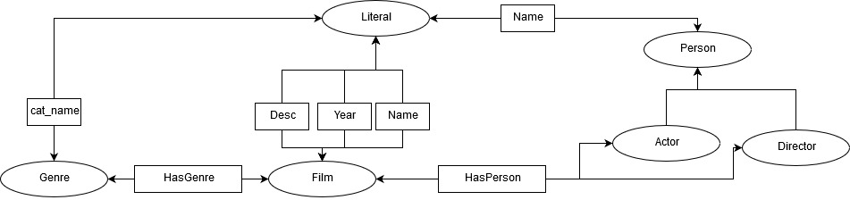
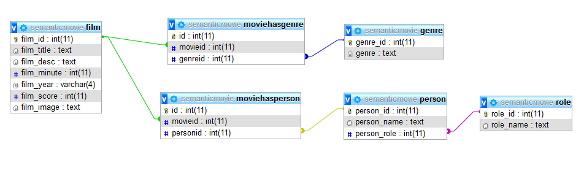
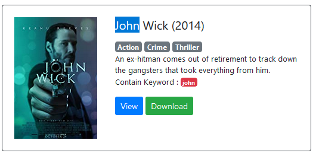
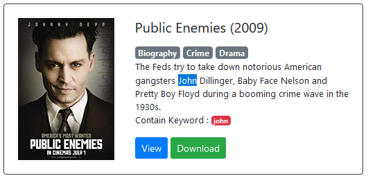
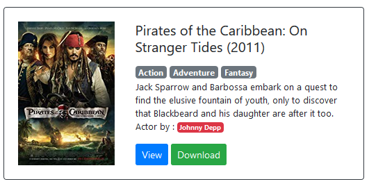
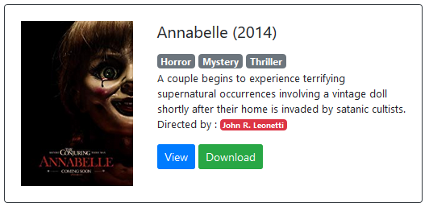

# MovieDatabase
## Tugas Akhir Semantic Web

[

## Movie Database

](index.php)[Home](index.php) | [Dokumentasi](dokumentasi.php) | [Text Mining](autosum.php)

RDF Schema  
  

Tabel  
  

Cara kerja :  
User memasukan query pencarian ke dalam sistem, kemudian sistem akan menampilkan hasil dengan urutan

1.  Judul/Deskripsi mengandung kata kunci
2.  Dimainkan oleh actor yang sesuai kata kunci
3.  Disutradarai oleh director yang sesuai kata kunci

    Ketika user memilih tombol download maka sistem mengarahkan user ke situs download film [Pahe.in](https://pahe.in/)  
Ketika user memilih tombol view maka akan menampilkan detail dari film tersebut  
Detail dari film didapat dari database lokal dan API request menggunakan [OMDb API](http://www.omdbapi.com/). Dari OMBd API didapat alamat [Rotten Tomatoes](https://www.rottentomatoes.com/) yang digunakan untuk menampilkan review film menggunakan [HTML DOM](https://simplehtmldom.sourceforge.io/index.htm). Selain menampilkan detail film sistem juga menampilkan gambar gif yang terkait dari situs [giphy](https://giphy.com/)  

Referensi  

*   [https://www.kaggle.com/PromptCloudHQ/imdb-data](https://www.kaggle.com/PromptCloudHQ/imdb-data)  
    IMDB data from 2006 to 2016 data set of 1,000 popular movies on IMDB in the last 10 years
*   [https://www.kaggle.com/orgesleka/imdbmovies](https://www.kaggle.com/orgesleka/imdbmovies)
*   [https://simplehtmldom.sourceforge.io/index.htm](https://simplehtmldom.sourceforge.io/index.htm)
*   [https://github.com/bereznd1/Movie-GIF-Retrieval](https://github.com/bereznd1/Movie-GIF-Retrieval)
*   [https://github.com/bayusujatmoko/MovieSearchWeb](https://github.com/bayusujatmoko/MovieSearchWeb)
*   [https://github.com/RasmusLindroth/OMDb-PHP-API](https://github.com/RasmusLindroth/OMDb-PHP-API)
*   [https://github.com/bereznd1/Movie-GIF-Retrieval](https://github.com/bereznd1/Movie-GIF-Retrieval)

